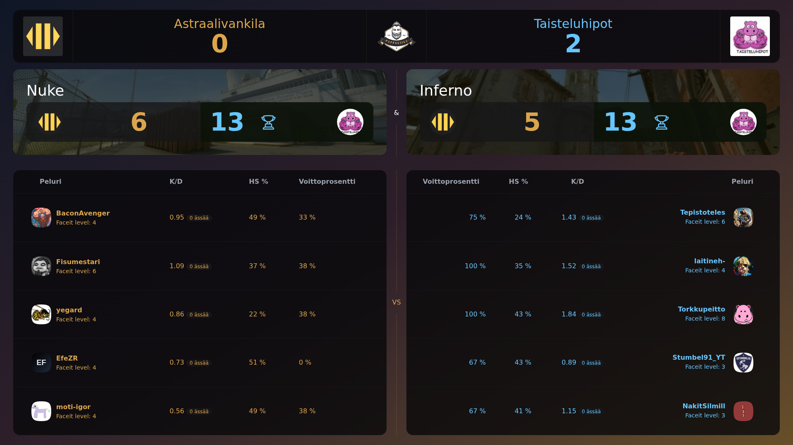

# FACEIT OBS Stats

Match statistics overlay system for CS2 broadcasting and OBS overlays. Provides map analytics, player performance, and pick/ban cards.

## Example



## Features

- **Match Statistics**: Map breakdowns with round wins, team performance, and match results
- **Player Statistics**: Individual analytics with K/D ratios, ADR, headshot percentages, and performance metrics
- **FACEIT Integration**: Real-time match data from FACEIT API with automatic match ID extraction
- **OBS Ready**: Clean overlay interface for broadcasting without input elements
- **Smart URL Handling**: Supports direct match IDs and full FACEIT URLs
 - **Demo Mode**: Built-in mock scenarios for fast previews

## Installation

1. Clone the repository:

   ```bash
   git clone https://github.com/oplehtinen/faceit-obs-stats.git
   cd faceit-obs-stats
   ```

2. Install dependencies:

   ```bash
   npm install
   ```

3. Create `.env` file:

   ```bash
   FACEIT_API_KEY=your_faceit_api_key_here
   ```

4. Start development server:

   ```bash
   npm run dev
   ```

5. Open `http://localhost:5173`

## Usage

### For Streamers

1. Navigate to statistics page:

   - `/mapstats` for map analysis (input page)
   - `/playerstats` for player metrics (input page)
   - `/mappicks` for map picks (input page)

2. Enter match data:

   - Paste FACEIT match URL or enter match ID directly

3. View statistics on dedicated read-only pages:
   - `/view/mapstats`, `/view/playerstats`, `/view/mappicks`
   - No input elements; ideal for OBS Browser Source

### Direct Links

Access statistics directly:

- Map Stats: `https://your-domain.com/view/mapstats?id=MATCH_ID`
- Player Stats: `https://your-domain.com/view/playerstats?id=MATCH_ID`
- Map Picks: `https://your-domain.com/view/mappicks?id=MATCH_ID`

## OBS Integration

1. Add Browser Source in OBS
2. Set URL to desired view page:
   - Map stats: `http://localhost:5173/view/mapstats`
   - Player stats: `http://localhost:5173/view/playerstats`
   - Map picks: `http://localhost:5173/view/mappicks`
3. Set size to match canvas (e.g., 1920×1080)
4. Right-click source > Interact, paste match ID or URL
5. Optional: Enable "Shutdown source when not visible" to reset between scenes

## API

### `/api/match-data`

Fetches match data from FACEIT API.

**Parameters:**

- `matchId` (required)
- `mock` (optional): `true` enables dynamic mock data

**Response:**

```json
{
	"matchDetailsData": {
		/* Match details */
	},
	"teamsData": {
		/* Team information */
	},
	"organizerData": {
		/* Tournament data */
	}
}
```

**Errors:** 404 Not Found, 401 Unauthorized, 500 Server Error

## Project Structure

```
src/
├── routes/
│   ├── +layout.svelte            # Main layout
│   ├── +page.svelte              # Landing page
│   ├── mapstats/+page.svelte     # Map stats input
│   ├── playerstats/+page.svelte  # Player stats input
│   ├── mappicks/+page.svelte     # Map picks input
│   ├── view/
│   │   ├── mapstats/+page.svelte   # Map stats view-only
│   │   ├── playerstats/+page.svelte # Player stats view-only
│   │   └── mappicks/+page.svelte    # Map picks view-only
│   └── api/match-data/+server.ts  # Unified match data endpoint
├── lib/
│   ├── components/               # UI components
│   ├── poller.ts                 # Centralized polling to stores
│   ├── faceit.ts                 # FACEIT API client wrappers
│   └── mockMatchData.ts          # Mock data generators
└── stores.ts                     # Centralized writable stores
```

## Development

**Scripts:**

- `npm run dev` - Development server
- `npm run build` - Build for production
- `npm run preview` - Preview build
- `npm run lint` - Run ESLint
- `npm run format` - Format code

## Deployment

### Vercel

1. Connect GitHub repository to Vercel
2. Set environment variables in dashboard
3. Auto-deploy on push to main

For other platforms, see [SvelteKit deployment docs](https://kit.svelte.dev/docs/adapters).

## Environment Variables

| Variable         | Description                   | Required |
| ---------------- | ----------------------------- | -------- |
| `FACEIT_API_KEY` | FACEIT API key for match data | Yes      |

## Tech Stack

- **Framework**: SvelteKit
- **Styling**: Tailwind CSS with DaisyUI
- **API**: FACEIT REST API
- **Deployment**: Vercel
- **Language**: TypeScript

## License

MIT License - see [LICENSE](LICENSE) file.

## Support

Use [GitHub Issues](https://github.com/oplehtinen/faceit-obs-stats/issues) for support and feature requests.
